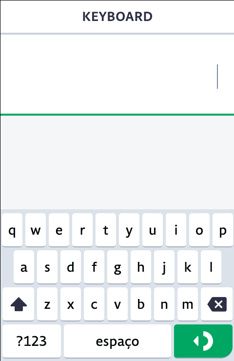
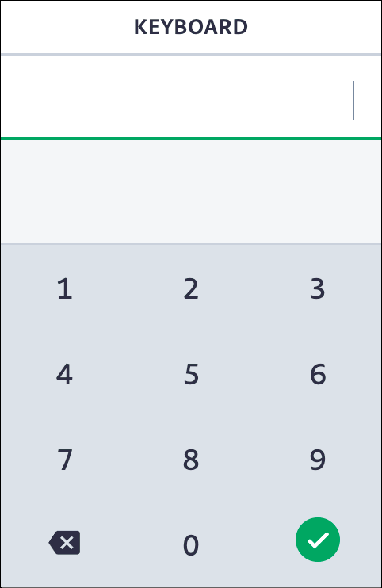
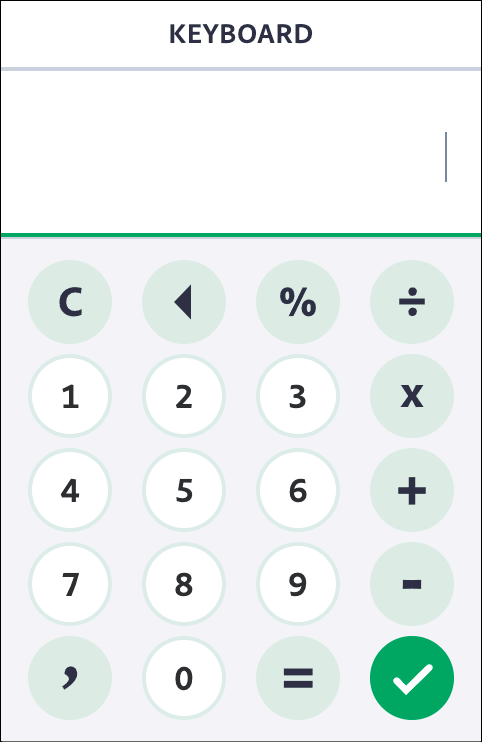
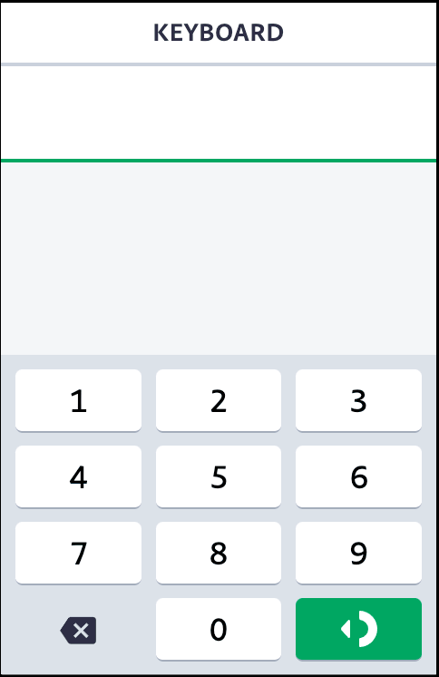

# Keyboard

Este módulo oferece uma série de funcionalidades referente ao telcado físico, virtual, mapeamento de teclas, e controle de input do teclado físico do seu POS.

## Teclado Virtual - Como usar

#### ◼︎ Adicine o componente `<Keyboard/>` na raiz do seu projeto.

<!-- prettier-ignore -->
```html
<Keyboard />

<script>
  export default {
    components: {
      Keyboard: '@mamba/keyboard/Keyboard.html',
    },
  };
</script>
```

#### ◼︎ Ou adicine o componente `<Keyboard/>` em uma rota específica, podendo assimm passar alguma de suas propriedades pelo HTML.

<!-- prettier-ignore -->
```html
<Keyboard keyboardType={KeyboardType.Math} />

<script>
  import { KeyboardType } from '@mamba/keyboard/lib/index.js';

  export default {
    components: {
      Keyboard: '@mamba/keyboard/Keyboard.html',
    },
    helpers: {
      KeyboardType,
    },
  };
</script>
```

As propriedades declaradas no elemento HTML, serão usadas no inicializador do teclado virtual, podendo também serem sobrescritas por seus métodos(ex.: [Keyboard.setOptions](#setoptionsoptions--void)) mais tarde. Essas propriedades são salvas como ponto de partida, caso use o método [Keyboard.reset](#reset-void) ou [Keyboard.resetOptions](#resetoptions-void)

## Examplo de uso da API

```js
import { KEYBOARD } from '@mamba/core';
import Keyboard from '@mamba/keyboard/api/index.js';
import { KeyboardType, KeyboardUpdateMode } from '@mamba/keyboard/lib/index.js';

Keyboard.isBackspaceEnabled(); // true

/** Disables the physical backspace button */
Keyboard.disableBackspace();

Keyboard.isBackspaceEnabled(); // false

/** Enables the physical backspace button */
Keyboard.enableBackspace();

/** Set virtual keyboard options */
Keyboard.setOptions({
  keyboardType: KeyboardType.Math,
  updateMode: KeyboardUpdateMode.Manual,
  maxLength: String(999.99).length - 1,
  onKeyPress: (button) => {
    if (button === KEYBOARD.ENTER) {
      // pay
    } else {
      // add input
    }
  },
});

/** Hide virtual keyboard */
Keyboard.hide();
```

### Boas Práticas e Dicas

- Por hora, o teclado virtual nunca será iniciado em POS's menores, então não é necessário iniciar seu componente para esses casos, para não usar processamento e memória desnecessariamente

```xml
<!-- index.html -->
<!-- Disable Keyboard for small pos at all -->
{#if !$POS.CAPABILITIES.IS_SMALL_SCREEN}
  <Keyboard autoRender="{false}" visibility="{KeyboardVisibility.Hidden}" keepVisible="{false}" />
{/if}
```

```js
// svelte.js
import { Device } from '@mamba/utils/index.js';

// ...
export const INITIAL_DATA = {
  POS: {
    CAPABILITIES: {
      IS_SMALL_SCREEN: Device.hasSmallScreen(),
    },
  },
};

const store = new Store(INITIAL_DATA);

// ...
```

- Como saber se o teclado virtual existe ou foi inicializado?

A api do teclado exporta uma propriedade em sua [Interface](#interface), que se chama `virtualKeyboard: Keyboard`, onde ela consulta e retorna se existe o teclado virtual ou não. Exemplo:

> No console do seu app:

```js
window.$Keyboard.virtualKeyboard; // `undefined` quer dizer não existe enhuma instância do teclado virtual
// ...
window.$Keyboard.virtualKeyboard; // `Keyboard {...}` quer dizer que existe uma instância do teclado virtual
```

> No código do seu app:

```diff
+ import Keyboard from '@mamba/keyboard/api/index.js';

# Pode quebrar:
- Keyboard.setOptions({
-   keyboardType: KeyboardType.Numeric,
- )}

# Ao invés, verifique se ele existe antes:
+ if (Keyboard.virtualKeyboard) {
+   Keyboard.setOptions({
+     keyboardType: KeyboardType.Numeric,
+   )}
+ }
```

Isso se faz útil para casos onde seu fluxo precisa fazer algum tratamento em sua rota, mas não sabe se o teclado virtual existe.

### Exemplos

Para exemplos de uso, [veja aqui](./EXAMPLES.md).

---

# API

## Opções do teclado virtual

Tenha cuidado se tiver mais de um campo de entrada na mesma página, pois essas são propriedades globais do teclado (O que se aplicar para um `<Input />`, será aplicado para todos).

````ts
interface KeyboardOptions {
  /**
   * Specifies which keyboard type should be used out of the box.
   * @defaultValue {@link KeyboardType.Default}
   */
  keyboardType?: KeyboardType;

  /**
   * Specifies a custom keyboard layout to be used. This should be used in addition to {@link KeyboardType} setted to {@link KeyboardType.Custom}
   */
  layout?: KeyboardLayoutObject;

  /**
   * Specifies which layout should be used inside the "layout" option, useful to handle function keys (e.g. "{shift}")". This should be used in addition to {@link KeyboardType} setted to {@link KeyboardType.Custom}. Initial layout also can be defined here.
   */
  layoutName?: string;

  /**
   * Specifies which direction layout should render. Horizontaly, Verticaly or Fixed.
   * - {@link LayoutDirection.Horizontal}, layout will render from left to right axis (row flow)
   * - {@link LayoutDirection.Vertical}, layout will render from top to bottom axis (column flow)
   * - {@link LayoutDirection.Fixed}, layout will render in fixed grid mode. This mode helps draw layout like `space-evenly` on POS. But not support flexible arrange.
   * @defaultValue {LayoutDirection.Horizontal}
   */
  layoutDirection?: LayoutDirection;

  /**
   * A prop to add your own css classes to the keyboard wrapper.
   * You can add multiple classes separated by a space.
   * Prefab keyboards have their own themes... set this property will remove its theme..
   */
  theme?: string;

  /**
   * Defines a class modifier to work with theme variations.
   * You can use some pre-variations of {@link KeyboardThemeVariation} or add your own css class, that can have multiple classes separated by space. Strings will be transformed to kebab-case automatically.
   *
   * The class its self will be the concatenation of keyboard slug with two dashes. eg.: `mb-variation--small`, `mb-variation--my-class`
   */
  themeVariation?: KeyboardThemeVariation | string;

  /**
   * Replaces variable buttons (such as `{backspace}`) with a human-friendly name (e.g.: `backspace`).
   */
  labels?: { [button: string]: string };

  /**
   * Converts button output value (such as `{check}`) to standard keyboard output (e.g.: `enter`).
   */
  outputs?: { [button: string]: string };

  /**
   * Change the CSS class to add to the button when it gets active by click.
   */
  activeButtonClass?: string;

  /**
   * Customize the CSS class to handle keyboard hidden events.
   *
   */
  hiddenKeyboardClass?: string;

  /**
   * Shows aditional debug information.
   * Runs a `console.log` every time a key is pressed.
   * Shows the buttons pressed and the current input.
   * Add `debug` class to main keyboard wrapper
   */
  debug?: boolean;

  /**
   * `number`: Restrains mamba keyboard input to a certain length.
   */
  maxLength?: any;

  /**
   * If input is readonly(or static `div` element as input), keyboard will disable cursor event handlers since it won't be necessary.
   *
   * This property do not change or include <input> readonly attribute
   */
  readonly?: boolean;

  /**
   * Tells keyboard which value it should use at input start position after key press input change. Like a currency placeholder.
   * Only works if the {@link updateMode} are on mode {@link KeyboardUpdateMode.Auto}.
   */
  lastValue?: string;

  /**
   * Tells keyboard if it should get or set number values only.
   * If some cases you dont want capture formatted values to internal keyboard virtual input, this props cleans the input work to number, to able to be formatted back again.
   * Useful for fields with formatting that happen after key events.
   */
  filtersNumbersOnly?: boolean;

  /**
   * Optionally set a condition for the virtual keyboard to render or work.
   * Its instance will be destroyed if exist.
   * Can be a Boolean or a function that do something and return a boolean.
   */
  renderCondition?: boolean | (() => boolean);

  /**
   * Enabled or disables keyboard events and actions.
   * This property do not change keybpard visibility.
   */
  disabled?: boolean;

  /**
   * Controls keyboard visibility.
   * Setting this propertie with `renderCondition: false` has no effect.
   */
  visibility?: KeyboardVisibility | string;

  /**
   * A prop to ensure characters are always be added/removed at the end of the string.
   */
  disableCursorPositioning?: boolean;

  /**
   * Restrains input(s) change to the defined regular expression pattern.
   */
  inputPattern?: RegExp;

  /**
   * Exclude specific buttons from each layout
   * @example
   *
   * ```js
   * excludeFromLayout: {
   *   default: ['a'],
   *   shift: ['B'],
   * }
   * ```
   */
  excludeFromLayout?: { [layoutName: string]: string[] };

  /**
   * Include specific function buttons to go through synthetic event dispatch.
   * This is useful to send key press of function keys to the input event handler, like math keys.
   *
   * The key code will be resolved by String.charcode if it's not already mapped. (only for single char)
   * @example
   * ```js
   * {
   *   ...
   *   // These keys will not display on input but send input events without braces
   *   // (e.g. KeyboardEvent({ key: "+", code: 107 }))
   *   allowKeySyntheticEvent: ['{+}', '{-}', '{*}', '{≠}'],
   * }
   * ```
   */
  allowKeySyntheticEvent?: string[];

  /**
   * Points key events to a customizable input element, instead of using document active element.
   * You can type and directly display the value in a `div` element setted with `data-keyboard="true" property`, so keyboard will insert its value to the element `innerText`.
   */
  input?: KeyboardInputOption;

  /**
   * Specifies if keyboard should operate automatic or manually.
   * - In automatic({@link KeyboardUpdateMode.Auto}) mode, it will try handle input key press value on focused elements.
   *
   * - In manually({@link KeyboardUpdateMode.Manual}) mode, it will leave the changes to you handle outside, using {@link KeyboardTypeEvents.onChange} event along with `oninput` DOM event.
   * @example
   * ```js
   * function onChange(input, e) {
   *   inputComponent.set({ value: input });
   * }
   *
   * const keyboard = new Keyboard({
   *  onChange: input => this.onChange(input),
   * });
   * // Update virtual keyboard input when the real one updates directly
   * inputDOMElement.addEventListener('input', event => {
   *   keyboard.setInput(event.target.value);
   * });
   *
   * ```
   *
   * @defaultValue {@link KeyboardUpdateMode.Auto}
   */
  updateMode?: KeyboardUpdateMode;

  /**
   * Keep keyboard visible (dont hide when input loose focus)
   *
   * @defaultValue `false`
   */
  keepVisible?: boolean;

  /**
   * Keep input cursor at its ends
   *
   * @defaultValue `false`
   */
  lockCursor?: boolean;

  /**
   * If  should render keyboard when it's instance creates
   * Call `render()` method to show the keyboard
   * @defaultValue `true`
   */
  autoRender?: boolean;

  /**
   * Make beep sound for every key press.
   * ! If set to `false`, you'll do not disable POS sound entirely. Only for this Keyboard instance.
   * If set to `true`, system sound preference will prevail(can be enabled or disable).
   * Other value different from boolean, will use system sound preference.
   * In other words, you can only disable sound of virtual keyboard but not force enable it.
   * @defaultValue System sound preference.
   */
  soundEnabled?: boolean;

  /**
   * Define keyboard beep tone
   *
   * @defaultValue {@link BeepTone.TONE_3}
   */
  beepTone?: BeepTone;

  /**
   * Define keyboard beep time
   *
   * @defaultValue `90`
   */
  beepTime?: number;

  /**
   * Enable or disables key suggestions
   * @defaultValue `true`
   */
  enableLayoutSuggestions?: boolean;

  /**
   * Character suggestions for especial and exotic keys
   * Define it was tuple it max of four optional words
   * Some prefab keyboard already have some latin words
   * @see [Default Suggestions](./mappings/defaultSuggestions.ts)
   */
  layoutSuggestions?: { [key: string]: [string?, string?, string?, string?] };

  /**
   * Other options can exist
   */
  [name: string]: any;
}
````

## Eventos do teclado virtual

```ts
type FunctionKeyPressCallback = (
  button: string,
  instance: Keyboard,
  e?: KeyboardHandlerEvent,
) => void;

interface KeyboardTypeEvents {
  /**
   * Executes thae callback function when virtual keyboard rendered by the first time.
   * @event
   */
  beforeFirstRender?: (instance: Keyboard) => void;

  /**
   * Executes a callback function before a virtual keyboard render.
   * @event
   */
  beforeRender?: (instance: Keyboard) => void;

  /**
   * Executes a callback function every time virtual keyboard is rendered (e.g: when you change layouts).
   * @event
   */
  onRender?: (instance: Keyboard) => void;

  /**
   * Executes a callback function once virtual keyboard is rendered for the first time (on initialization).
   * @event
   */
  onInit?: (instance: Keyboard) => void;

  /**
   * Retrieves the current input
   * @event
   */
  onChange?: (input: string, e?: KeyboardHandlerEvent) => void;

  /**
   * Executes a callback function on any key press of virtual keyboard. Returns button layout name (i.e.: “{enter}”, "b", "c", "2" ).
   * @event
   */
  onKeyPress?: (button: string, e?: KeyboardHandlerEvent) => void;

  /**
   * Execute a callback function on keypress of non-standard type only (functionality type i.e.: “{alt}”) of virtual keyboard.
   * @event
   */
  onFunctionKeyPress?: FunctionKeyPressCallback;

  /**
   * Execute a callback function on keypress of standard type only (type i.e.: “a”, “k”, “5”) of virtual keyboard.
   * @event
   */
  onStandardKeyPress?: FunctionKeyPressCallback;
}
```

### Passando opções pelo `<Input />`

Você pode passar opções simples, compatíveis com **JSON** _(não aceita funções/eventos do teclado)_, pelo elemento HTML input:

<!-- prettier-ignore -->
```html
<Input
  data-keyboard="true"
  data-keyboard-options='{ "themeVariation": "my-variation", "keepVisible": false }'
/>
```

Caso você utilize o `@mamba/input`, é mais permissivo:

<!-- prettier-ignore -->
```html
<Input
  label="Insira o valor"
  keyboardOptions={{ themeVariation: KeyboardThemeVariation.Compact }}
/>

<script>
  export default {
    components: {
      Input: '@mamba/input',
    },
  };
</script>
```

---

# API

Responsável por expor métodos de controle sobre o teclado físico e virutal, bem como métodos de ajuda auxiliares do POS, e acesso aos métodos do teclado virtual e derivados.

## Interface

```ts
interface Keyboard {
  virtualKeyboard: Keyboard;
  visibility: KeyboardVisibility;
  setKeyboardInputAsNumeric: () => void;
  setKeyboardInputAsAlphanumeric: () => void;
  getKeyCode: (keyName: string) => number;
  getKeyName: (keyCode: number) => string;
  isNumericKey: (keyCode: number) => boolean;
  isActionKey: (keyCode: number) => boolean;
  isBackspaceEnabled: () => boolean;
  disableBackspace: () => void;
  enableBackspace: () => void;
  setKeyboardType(type: KeyboardType): void;
  setOptions(options?: {}): void;
  setInput(input: string): void;
  getInput(): string;
  clearInput(): void;
  replaceInput(keyboardInput: { default: string }): void;
  render(): void;
  show(): void;
  hide(): void;
  unmount(): void;
  resetOptions(): void;
  reset(): void;
  currentInputPatternIsValid(): boolean;
  getButtonElement(button: string): undefined | KeyboardElement | KeyboardElement[];
  setKeyboardAsCustomType(options: KeyboardOptions = {}): void;
  setKeyboardAsDefaultType(): void;
  setKeyboardAsMathType(): void;
  setKeyboardAsNumericType(): void;
  setKeyboardAsPhoneType(): void;
  destroy(): void;
}
```

## Métodos

### `setKeyboardInputAsNumeric()`

Define que a máquina irá digitar apenas números.

```js
import Keyboard from '@mamba/keyboard/api/index.js';

Keyboard.setKeyboardInputAsNumeric();
```

### `setKeyboardInputAsAlphanumeric()`

Define que a máquina irá digitar caracteres alfanuméricos.

```js
import Keyboard from '@mamba/keyboard/api/index.js';

Keyboard.setKeyboardInputAsAlphanumeric();
```

### `getKeyCode(keyName: string)`

Retorna o `código da tecla` referente a uma tecla da máquina.

```js
import Keyboard from '@mamba/keyboard/api/index.js'

Keyboard.getKeyCode('Enter'); // 13
Keyboard.getKeyCode('enter'); // 13

Keyboard.getKeyCode('Back'); // 8
Keyboard.getKeyCode('Close'); // 27
Keyboard.getKeyCode('Help'); // 17
Keyboard.getKeyCode('Shortcuts'); // 16
Keyboard.getKeyCode('0'); // 48
...
Keyboard.getKeyCode('9'); // 57
```

### `parseEventKeys(event: KeyboardEvent) `

Obtem o código e nome da tecla normalizado de acordo com a tabela de teclas do POS através de um evento de entrada de teclado.
Retorna uma tupla de tamanho 2, onde o índice 0 é o código encontrado, e o de índice 1, o nome da tecla.

```js
import Keyboard from '@mamba/keyboard/api/index.js';

/**
 * @param {KeyboardEvent} event
 */
function onKeydown(event) {
  const [keyCode, keyName] = Keyboard.parseEventKeys(event);
}
```

### `parseEventKeyName(event: KeyboardEvent) `

Obtem o nome da tecla normalizado de acordo com a tabela de teclas do POS através de um evento de entrada de teclado.
Retorna o nome da tecla.

```js
import Keyboard from '@mamba/keyboard/api/index.js';

/**
 * @param {KeyboardEvent} event
 */
function onKeydown(event) {
  const keyName = Keyboard.parseEventKeyName(event);
}
```

### `parseEventKeyCode(event: KeyboardEvent) `

Obtem o código da telca compatível com o ecosistema do simulador, teclado virtual e POS físico.
Retorna o código da tecla do hardware.

```js
import Keyboard from '@mamba/keyboard/api/index.js';

/**
 * @param {KeyboardEvent} event
 */
function onKeydown(event) {
  const keyCode = Keyboard.parseEventKeyCode(event);
}
```

### `getKeyName(keyCode: number)`

Retorna o `nome da tecla` referente ao código de uma tecla da máquina.

```js
import Keyboard from '@mamba/keyboard/api/index.js'

Keyboard.getKeyName(13); // 'enter'
Keyboard.getKeyName(8); // 'back'
Keyboard.getKeyName(27); // 'close'
Keyboard.getKeyName(17); // 'help'
Keyboard.getKeyName(16); // 'shortcuts'
Keyboard.getKeyName(48); // '0'
...
Keyboard.getKeyName(57); // '9'
```

### `isNumericKey(keyCode: number): void`

Retorna se uma tecla representa um número.

```js
import Keyboard from '@mamba/keyboard/api/index.js';

/** 13 = 'enter' */
Keyboard.isNumericKey(13); // false

/** 57 = '9' */
Keyboard.isNumericKey(57); // true
```

### `isActionKey(keyCode: number): void`

(_Obsoleto_, usar `isFunctionKey()`)

Retorna se uma tecla representa uma ação.

```js
import Keyboard from '@mamba/keyboard/api/index.js';

/** 13 = 'enter' */
Keyboard.isActionKey(13); // true

/** 57 = '9' */
Keyboard.isActionKey(57); // false
```

### `isFunctionKey(keyCode: number): void`

Retorna se uma tecla representa uma ação.

```js
import Keyboard from '@mamba/keyboard/api/index.js';

/** 13 = 'enter' */
Keyboard.isFunctionKey(13); // true

/** 57 = '9' */
Keyboard.isFunctionKey(57); // false
```

### `isBackspaceEnabled(): void`

Retorna se o uso do botão físico de `voltar`/`backspace` está habilitado ou não no aplicativo.

### `disableBackspace(): void`

Desabilita o uso do botão físico de `voltar`/`backspace` no aplicativo em questão.

### `enableBackspace(): void`

Habilita o uso do botão físico de `voltar`/`backspace` no aplicativo em questão.

### `setKeyboardType(type: KeyboardType): void`

Altere o tipo de teclado passando um dos tipos do `KeyboardType`.

### `setOptions(options?: {}): void`

Define uma nova opção ou modifica as existentes após a inicialização.

### `setInput(input: string): void`

Defina a entrada virtual do teclado virtual. Este método não altera o valores de elementos `<input>`

### `getInput(): string`

Obtenha a entrada virtual do teclado virtual (você também pode obtê-la pela propriedade `onChange`).

### `clearInput(): void`

Limpa a entrada virtual do teclado virtual.

### `replaceInput(keyboardInput: { default: string }): void`

Substitui o valor de entrada virtual do teclado virtual.

### `render(): void`

Renderiza ou atualiza os botões do teclado.
Pode ser chamado direto se `autoRender` estiver desativado.

> `@throws LAYOUT_NOT_FOUND_ERROR` - layout não encontrado.
>
> `@throws LAYOUT_NAME_NOT_FOUND_ERROR` - nome do layout não encontrado no objeto de layout

### `show(): void`

Mostra o teclado e montá-lo se já não estiver.

### `hide(): void`

Oculta o teclado. Esse método faz menos processamento do que a propriedade `visibility`.

### `unmount(): void`

Remove todas as linhas do teclado e define a visibilidade como oculta.

### `resetOptions(): void`

Redefine as propriedades do teclado.

### `reset(): void`

Redefine as propriedades do teclado e os elementos do teclado.

### `currentInputPatternIsValid(): boolean`

Retorna se a entrada atual é válida com a propriedade `pattern` configurada.

### `getButtonElement(button: string): undefined | KeyboardElement | KeyboardElement[]`

Obtém o elemento DOM de um botão. Se houver vários botões com o mesmo nome, será retornado um array dos Elementos DOM.

### `setKeyboardAsCustomType(options: KeyboardOptions = {}): void`

Defina o teclado virtual como tipo personalizado.
Esse método ja define por si só, o tipo do teclado para o tipo customizado(`KeyboardType.Custom`)

### `setKeyboardAsDefaultType(): void`

Defina o teclado virtual do tipo alfanumérico padrão.

### `setKeyboardAsMathType(): void`

Defina o teclado virtual do tipo calculadora.

### `setKeyboardAsNumericType(): void`

Defina o teclado virtual como tipo numérico.

### `setKeyboardAsPhoneType(): void`

Defina o teclado virtual como tipo de telefone.

### `destroy(): void`

Destroi o teclado virtual, remove seus ouvintes e elementos do DOM. Este método não deve ser usado se você estiver usando o componente `<Keyboard />`.

### `shouldUpdateKeyboardView(): void`

Atualiza os estilos automáticos do teclado virtual. Normalmente posicionamento na tela.

### `updateSoundEnabledState(): void`

Atualiza o estado do som do teclado virtual com base nas configurações do POS.

## Enumeradores

```ts
/**
 * Keyboard update mode
 */
enum KeyboardUpdateMode {
  Auto = 'auto',
  Manual = 'manual',
}

/**
 * Keyboard visibility
 */
enum KeyboardVisibility {
  Hidden = 'hidden',
  Visible = 'visible',
}

/**
 * Layout row direction
 */
enum LayoutDirection {
  Horizontal = 'horizontal',
  Vertical = 'vertical',
  Fixed = 'fixed',
}

/**
 * Keyboard enum
 */
enum KeyboardType {
  Default = 'default',
  Numeric = 'numeric',
  Phone = 'phone',
  Math = 'math',
  Custom = 'custom',
}

/**
 * Keyboard theme variation
 */
export enum KeyboardThemeVariation {
  Large = 'large', // For large screens and high DPI without zoom
  Default = 'default', // Default variation for general purpose
  Compact = 'compact', // Reduced spaces and height
  UltraSmall = 'ultra-small', // For very small screens
}

/**
 * Beep tone
 */
enum BeepTone {
  TONE_1 = 'TONE1',
  TONE_2 = 'TONE2',
  TONE_3 = 'TONE3',
  TONE_4 = 'TONE4',
  TONE_5 = 'TONE5',
  TONE_6 = 'TONE6',
  TONE_7 = 'TONE7',
}
```

# Teclados pré-disponíveis

São teclados com temas e já configurado para uso.

```js
import Keyboard from '@mamba/keyboard/api/index.js';
import { KeyboardType } from '@mamba/keyboard/lib/index.js';

Keyboard.setOptions({
  keyboardType: KeyboardType.Numeric,
});
```

## Ou use um dos métodos prontos:

### ◼︎ Default _(alfanumérico)_


<br/><br/>

```js
import Keyboard from '@mamba/keyboard/api/index.js';

Keyboard.setKeyboardAsDefaultType();
```

### ◼︎ Numérico


<br/><br/>

```js
import Keyboard from '@mamba/keyboard/api/index.js';

Keyboard.setKeyboardAsNumericType();
```

### ◼︎ Calculadora


<br/><br/>

```js
import Keyboard from '@mamba/keyboard/api/index.js';

Keyboard.setKeyboardAsMathType();
```

### ◼︎ Telefone (Number pad)


<br/><br/>

```js
import Keyboard from '@mamba/keyboard/api/index.js';

Keyboard.setKeyboardAsPhoneType();
```

## Keyboard native key map

Para usar as teclas nativas do teclado (teclado físico POS), você precisa instalar `@mamba/core`.
O objeto `KEYBOARD` fornece os mapas de teclas e nomes de teclas específicos do POS.

```js
import { KEYBOARD } from '@mamba/core';
```

See [@mamba/core Docs](../../core/README.md) for more info.

## Migração para v8.x.x

- As propriedades iniciais do componente `@mamba/keyboard/Keyboard.html`, deixaram de ser feitas pela propriedade `keyboardOptions`, e sendo usadas/lidas diretamente:

  ```diff
  - <Keyboard keyboardOptions={{
  -     autoRender: false,
  -     visibility: KeyboardVisibility.Hidden,
  -     keepVisible: false
  -   }}
  - />

  + <Keyboard
  +   autoRender={false}
  +   visibility={KeyboardVisibility.Hidden}
  +   keepVisible={false}
  + />
  ```

- Use o método `Keyboard.parseEventKeyCode(event: KeyboardEvent )` para parsear corretamente o código da telca de entrada e descobrir qual o `keyCode` (código da tecla) ou `keyName` (nome da tecla):

  ```diff
  + import Keyboard from '@mamba/keyboard/api/keyboard.js';

  - const keyCode = event.code && event.code !== 0 ? event.code : event.charCode || event.which || event.keyCode;
  - const keyName = Keyboard.getKeyName(keyCode);

  + const [keyCode, keyName] = Keyboard.parseEventKeys(event);
  ```
